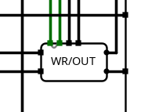

# Processador Pipeline - Mips


## Descrição Geral

Este projeto consiste na implementação de um processador com arquitetura pipeline, desenvolvido com o objetivo de aplicar os conceitos teóricos aprendidos na disciplina de Arquitetura e Organização de Computadores, ofertada pela Universidade Federal do Cariri (UFCA).

O processador foi projetado com foco na execução eficiente de instruções utilizando um modelo de execução segmentada em estágios (pipeline), permitindo o processamento paralelo de diferentes instruções em diversas fases do ciclo de execução.

Este projeto foi desenvolvido sob a orientação do professor Ramon Santos Nepomuceno durante a disciplina de Arquitetura e Organização de Computadores, no curso de Ciência da Computação da Universidade Federal do Cariri (UFCA).


## Autores

[Rafael da Silva Sousa](https://github.com/RafaelLiufe)     
[Otavio da Silva Ferreira](https://github.com/Otavio-Ferreira)     

Estudantes de Ciência da Computação na [Universidade Federal do Cariri](https://www.ufca.edu.br/).

# Instruções 

## Descrição Geral

As instruções do processador foram classificadas em três formatos principais: Tipo R, Tipo I e Tipo J, seguindo a convenção tradicional de processadores RISC. Cada tipo possui uma estrutura binária distinta, utilizada para representar diferentes categorias de operações, como aritméticas, lógicas, de acesso à memória e controle de fluxo.

## Tipo R

### Formato:
Instruções do tipo R são voltadas para operações aritméticas e lógicas entre registradores. A estrutura do formato é:

| OPCODE | RS | RT | RD | SHAMT | FUNC |
| :---: | :---: | :---: | :---: | :---: | :---: |
| 6 BITS | 5 BITS | 5 BITS | 5 BITS | 5 BITS | 6 BITS |

### Explicação:
- RS: Registrador fonte 1
- RT: Registrador fonte 2
- RD: Registrador de destino
- SHAMT: Quantidade de deslocamento para instruções de shift
- FUNC: Código da operação específica (usado junto ao opcode 000000)

### Instruções:

| INSTRUÇÃO | OPCODE  | FUNCT   | FORMATO | SIGNIFICADO |
| --- | :---: | :---: | :---: | --- |
| ADD rd,rs,rt | 000000 | 000000 | R | BR[rd] = BR[rs] + BR[rt] |
| SUB rd,rs,rt | 000000 | 000001 | R | BR[rd] = BR[rs] - BR[rt] |
| MULT rd,rs,rt | 000000 | 000010 | R | BR[rd] = BR[rs] * BR[rt] |
| DIV rd,rs,rt | 000000 | 000011 | R | BR[rd] = BR[rs] / BR[rt] |
| AND rd, rs, rt | 000000 | 000100 | R | BR[rd] = BR[rs] AND BR[rt] |
| OR rd, rs, rt | 000000 | 000101 | R | BR[rd] = BR[rs] OR BR[rt] |
| SLT rd, rs, rt | 000000 | 000110 | R | BR[rd] = (BR[rs] < BR[rt]) ? 1 : 0 |
| SLL rs, rt, shamt | 000000 | 000111 | R | BR[rt] = BR[rs] << shamt |
| SLR rs, rt, shamt | 000000 | 001000 | R | BR[rt] = BR[rs] >> shamt |

## Tipo I

### Formato:
Instruções do tipo I operam com valores imediatos e são utilizadas para aritmética com constantes, controle de fluxo e acesso à memória.

| OPCODE | RS | RT | IMEDIATO |
| :---: | :---: | :---: | :---: |
| 6 BITS | 5 BITS | 5 BITS | 16 BITS |

### Explicação:
- RS: Registrador fonte
- RT: Registrador destino
- IMEDIATO: Valor constante de 16 bits

### Instruções:

| INSTRUÇÃO | OPCODE | FUNCT | FORMATO | SIGNIFICADO |
| --- | :---: | :---: | :---: | --- |
| ADDI rs, rt, Imm | 000001 | N.A | I | BR[rt] = BR[rs] + Imm |
| SUBI rs, rt, Imm | 000010 | N.A | I | BR[rt] = BR[rs] - Imm |
| MULI rs, rt, Imm | 000011 | N.A | I | BR[rt] = BR[rs] * Imm |
| DIVI rs, rt, Imm | 000100 | N.A | I | BR[rt] = BR[rs] / Imm |
| LW rt, Imm(rs) | 000111 | N.A | I | BR[rt] = MD[BR[rs] + Imm] |
| SW rt, Imm(rs) | 001000 | N.A | I | MD[BR[rs] + Imm] = BR[rt] |
| BEQ rs, rt, Imm | 000101 | N.A | I | if (BR[rt] == BR[rs]) { PC = Imm } else { PC = PC+1 } |
| BNE rs, rt, Imm | 001001 | N.A | I | if (BR[rs] != BR[rt]) PC = Imm |
| SLTI rs, rt, Imm | 000110 | N.A | I | BR[rt] = (BR[rs] < Imm) ? 1 : 0 |
| JR rs | 001100 | N.A | I | PC = BR[rs] |

## Tipo J

### Formato
Instruções do tipo J são utilizadas para saltos incondicionais, com endereços representados por um rótulo de 26 bits.

| OPCODE | LABEL |
| :---: | :---: |
| 6 BITS | 26 BITS |

### Explicação:
- Label: Valor constante de 26 bits

### Instruções:
| INSTRUÇÃO | OPCODE | FUNCT | FORMATO | SIGNIFICADO |
| --- | :---: | :---: | :---: | --- |
| JAL label | 001011 | N.A | J | BR[31] = PC + 4; PC = label |
| J label | 001010 | N.A | J | PC = label |

---

# Pipeline

O pipeline de um processador divide a execução de uma instrução em **5 estágios principais**, permitindo que várias instruções sejam executadas em paralelo, aumentando a eficiência. Cada estágio possui um **registrador de pipeline** intermediário que armazena os dados e sinais necessários para a próxima etapa.

## Estágios do Pipeline

1. **IF (Instruction Fetch)** – Busca da instrução na memória.
2. **ID (Instruction Decode)** – Decodificação da instrução e leitura dos registradores.
3. **EX (Execution)** – Execução das operações da ULA ou cálculo de endereços.
4. **MEM (Memory)** – Acesso à memória de dados (load/store).
5. **WB (Write Back)** – Escrita dos resultados de volta no banco de registradores.

## Registradores de Pipeline

* `IF/ID`: Armazena a instrução buscada e o PC + 4.
* `ID/EX`: Contém os sinais de controle, registradores lidos e instrução decomposta.
* `EX/MEM`: Guarda o resultado da execução da ULA e sinais de controle para a memória.
* `MEM/WB`: Carrega o valor final a ser escrito no banco de registradores.

---

## Fase IF (Instruction Fetch)

Responsável por buscar a instrução da memória de instruções com base no valor atual do **PC (Program Counter)**.

### PC


Circuito que escolhe o próximo valor do PC com base na instrução:

* `PC + 4` (fluxo normal)
* Endereço de desvio (`BEQ/BNE`)
* Endereço de salto (`J`)
* Registrador (`JR`)

### Instruction Memory


Memória que armazena todas as instruções do programa. O endereço do PC é usado para buscar a instrução atual.

---

## Fase ID (Instruction Decode)

Responsável por decodificar a instrução, ler os registradores e gerar os sinais de controle.

### Instruction Decompose


A instrução é decomposta em seus campos: `opcode`, `rs`, `rt`, `rd`, `shamt`, `funct`, etc., por meio de splitters (separadores de bits).

### Banco de Registradores


Circuito que armazena e fornece os valores dos registradores especificados em `rs` e `rt`.

### Forward Unit 2


Detecta quando uma instrução está tentando ler um registrador que outra instrução ainda não escreveu, permitindo o encaminhamento de dados diretamente da etapa `WB`.

### Unidade de Controle (UC)


Gera os sinais de controle com base no `opcode`:

* `RegDst`, `Jump`, `Branch`, `MemtoReg`
* `ALUOp`, `MemWrite`, `ALUSrc`, `RegWrite`, `JR`

---

## Fase EX (Execution)

Executa operações aritméticas, lógicas e cálculos de endereço de memória.

### ALU Mux Control


Multiplexadores escolhem os operandos da ALU:

* `data_rs`, `data_rt`, `imediato`, `shamt`
* Dados podem vir do banco ou via forwarding.

### ALU Control ULA


A ULA realiza operações como soma, subtração, comparação, etc., com base nos sinais da `ALU Control`.

### PC Encode


Codifica o endereço de destino para instruções do tipo `Jump`.

### Wr/Out



Escolhe qual registrador receberá o resultado:

* `rd` (tipo R), `31` (JAL), ou outro dependendo do tipo da instrução.

---

## Fase MEM (Memory)

Executa leitura ou escrita na memória de dados, dependendo da instrução.

### Decide Branch


Verifica condições de desvio (`BEQ`, `BNE`) e sinaliza se o PC deve ser alterado.

### Data Memory


Memória onde ocorrem as operações `LW` (leitura) e `SW` (escrita) com base no resultado da ULA.

---

## Fase WB (Write Back)

Última etapa: escreve os resultados no banco de registradores.

### Mux WB


Multiplexador decide entre o valor vindo da ULA ou da memória (`LW`) para escrita no registrador destino.

---

## Forwarding Unit


Resolve dependências de dados ao permitir que os valores que ainda não foram gravados no banco de registradores sejam usados diretamente pelas instruções seguintes.

---

## Hazard Unit


Detecta e resolve *data hazards* críticos, especialmente após instruções `LW`. Quando necessário, insere bolhas no pipeline, pausando o `PC` e limpando o registrador `ID/EX`.

---

Perfeito! Aqui está a versão organizada com **subtítulos**, explicações breves para cada teste e **blocos de código separados** (estilo Markdown) para facilitar a **cópia e colagem individual** de cada teste.

Você pode usar isso diretamente em um arquivo `.md` (como `testes_pipeline.md`) ou numa área de documentação.

---

# Testes do Pipeline

Todos os testes abaixo seguem o formato `v2.0 raw` e devem ser salvos em um arquivo `.txt` ou `.md`. Basta copiar e colar o teste desejado no seu simulador para verificar o comportamento do pipeline com forwarding e hazards.

---

## Teste 1: Forwarding entre instruções ALU-ALU

Testa o uso correto de valores recém-calculados entre duas instruções ALU.

```asm
v2.0 raw

04080005 # addi $t0, $zero, 5     # $t0 = 5
0409000a # addi $t1, $zero, 10    # $t1 = 10
01095000 # add  $t2, $t0, $t1     # $t2 = 15
01485801 # sub  $t3, $t2, $t0     # $t3 = 10
```

---

## Teste 2: Forwarding de Load para ALU

Testa se o dado carregado com `lw` é corretamente passado adiante antes de ser escrito no banco de registradores.

> ⚠️ **A memória na posição 0 deve conter o valor 5.**

```asm
v2.0 raw

04080000 # addi $t0, $zero, 0     # $t0 = 0
1d090000 # lw   $t1, 0($t0)       # $t1 = Mem[0] = 5
01295000 # add  $t2, $t1, $t1     # $t2 = 10
01495800 # add  $t3, $t2, $t1     # $t3 = 15
```

---

## Teste 3: Forwarding entre ALU e Branch

Testa o uso do resultado de uma operação ALU imediatamente antes de uma instrução de desvio condicional `beq`.

```asm
v2.0 raw

04080001 # addi $t0, $zero, 1     # $t0 = 1
04090001 # addi $t1, $zero, 1     # $t1 = 1
01095000 # add  $t2, $t0, $t1     # $t2 = 2
152a000a # beq  $t2, $t1, LABEL   # Deve ser falso (2 ≠ 1), não desvia
```

---

## Teste 4: Forwarding entre ALU e Store

Testa o uso de um valor recém-calculado em uma instrução `sw`.

```asm
v2.0 raw

04080064 # addi $t0, $zero, 100   # $t0 = 100
04090004 # addi $t1, $zero, 4     # $t1 = endereço 4
21280000 # sw   $t0, 0($t1)       # Mem[4] = $t0 (100)
```

---

## Teste 5: Encadeamento de Forwarding (Cascata)

Testa se múltiplos encadeamentos consecutivos de forwarding funcionam corretamente.

```asm
v2.0 raw

04080001 # addi $t0, $zero, 1     # $t0 = 1
01084800 # add  $t1, $t0, $t0     # $t1 = 2
01295000 # add  $t2, $t1, $t1     # $t2 = 4
014a5800 # add  $t3, $t2, $t2     # $t3 = 8
```

---

